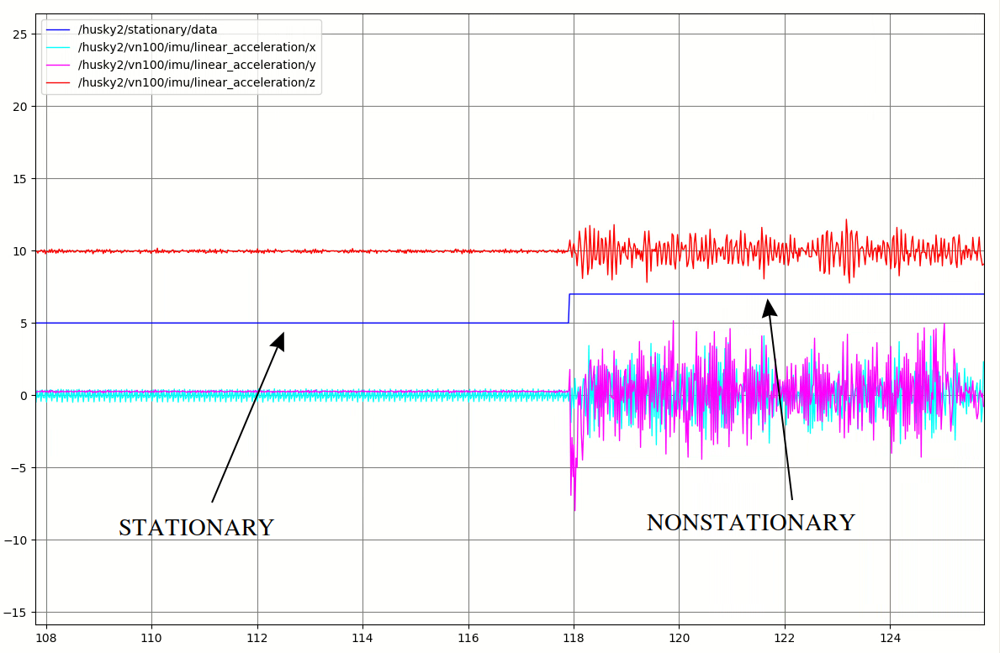
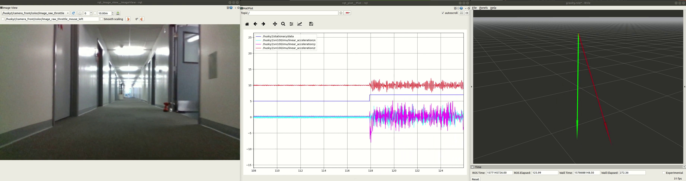

# Zero Velocity Detector (aka Very Stable Genius)

This library and node determines if the robot is stationary. This is useful for determining when to incorporate gravity vector constraints into the global localization pose graph. Without this, the gravity vector measurements were found to be too noisy to be useful. 

The library and node are very simple: if all accelerometer and gyroscope measurements stay within certain bounds over 3 seconds, it considers the robot stationary. More specifically, there is a circular buffer that holds up to 3 seconds of IMU measurements. On receiving each IMU message, it computes the average reading on each axis (gyroscope x, y, z, and accelerometer x, y, z) over 3 seconds, and then it computes the maximum difference between each measurement and the average. If any of the maximum differences exceed a threshold, the robot is reported nonstationary. Otherwise, it is reported stationary. During the first 3 seconds at startup, the library reports a special initializing state while the circular buffer is being populated. 

Some notes about performance. If the library states that the robot is stationary, it is *very likely* that the robot is stationary. If the library states that the robot is nonstationary, it could either be stationary or nonstationary: in other words, it should *not* be used to determine if the robot is moving. There is a lag of 3 seconds (the size of the circular buffer) from when the robot stops moving to when the library states that the robot is stationary.

The following two videos show the library/node running on a subset of the 2019-12-23 198 T1 dataset. The blue line in the middle of the rqt_plot is a visualization of the "stationary" signal, where '5' represents 'stationary', '7' represents 'nonstationary', and at the beginning, '0' represents 'initializing'.

https://drive.google.com/file/d/1gugc4TWmrKHeuLuIka-jYdozByHkuz3Y/view

https://drive.google.com/file/d/1PJpse2vMFTizTKqwQffuMjCccEHUmrt6/view

In the second video, the green vector is the average gravity vector, updated only when the robot is reported stationary, and the translucent red vector is the raw accelerometer reading. The main takeaway is that the average gravity (green) vector is very stable. 

Users can configure the library in cfg/very_stable_config.yaml. The available parameters include the length of the circular buffer (e.g. 1 second vs. 3 second) and the measurement bounds that determine if the robot is stationary. The user must specify the IMU rate in Hz in the config file: this is not determined automatically. The imu_rate * observation_period determines the number of elements in the circular buffer.

This software was primarily tested against Husky2. On Husky2, I have observed a 20Hz, 1 m/s^2 peak-to-peak signal present in the accelerometer x-axis. Theories include the two Velodynes causing the IMU to vibrate, or the Husky controller oscillating. For now, the bounds have been increased to accommodate these oscillations while stationary. The slides below provide an overview of the issue.

https://docs.google.com/presentation/d/1aqGoVuSFV1zrMOWIYrcr0Ctr46k3RCjmqJQ9FUXKw_A/edit?usp=sharing

